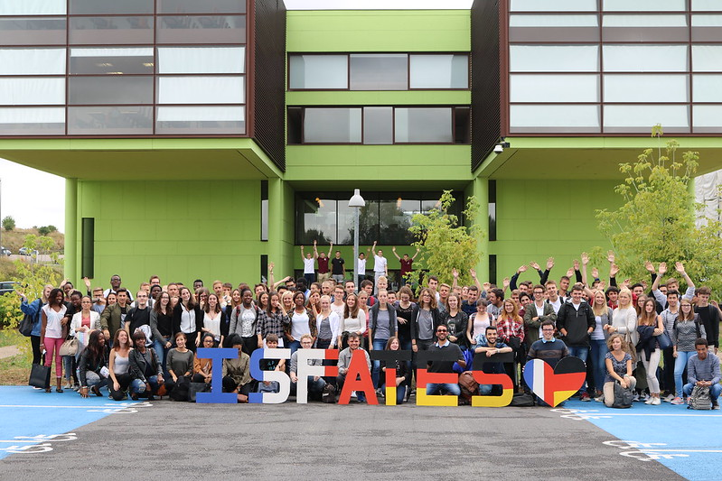

# ISFATES DFHI Slidev Theme

Presentation slides for developers

<div class="pt-12">
  <span @click="next" class="px-2 p-1 rounded cursor-pointer hover:bg-white hover:bg-opacity-10">
    Press Space for next page <carbon:arrow-right class="inline"/>
  </span>
</div>

---

# Plan
<Hr />

<Toc />

---

# What is Slidev?
<Hr />


Slidev is a slide maker and presentation tool designed for developers. It includes the following features:

- 📝 **Text-based** - focus on your content with Markdown, then style it later
- 🎨 **Themable** - themes can be shared and reused as npm packages
- 🧑‍💻 **Developer Friendly** - code highlighting, live coding with autocompletion
- 🤹 **Interactive** - embed Vue components to enhance your expressions
- 🎥 **Recording** - built-in recording and camera view
- 📤 **Portable** - export to PDF, PPTX, PNGs, or even a hostable SPA
- 🛠 **Hackable** - virtually anything that's possible on a webpage is possible in Slidev

<br>
<br>

Read more about [Why Slidev?](https://sli.dev/guide/why)

---

# Display an image
<Hr />


<div class="flex justify-center mt-4">
  
</div>

---
layout: image-right
image: https://cover.sli.dev
---

# Code
<Hr />

Use code snippets and get the highlighting directly!

```ts
interface User {
  id: number
  firstName: string
  lastName: string
  role: string
}

function updateUser(id: number, update: Partial<User>) {
  const user = getUser(id)
  const newUser = { ...user, ...update }
  saveUser(id, newUser)
}
```
